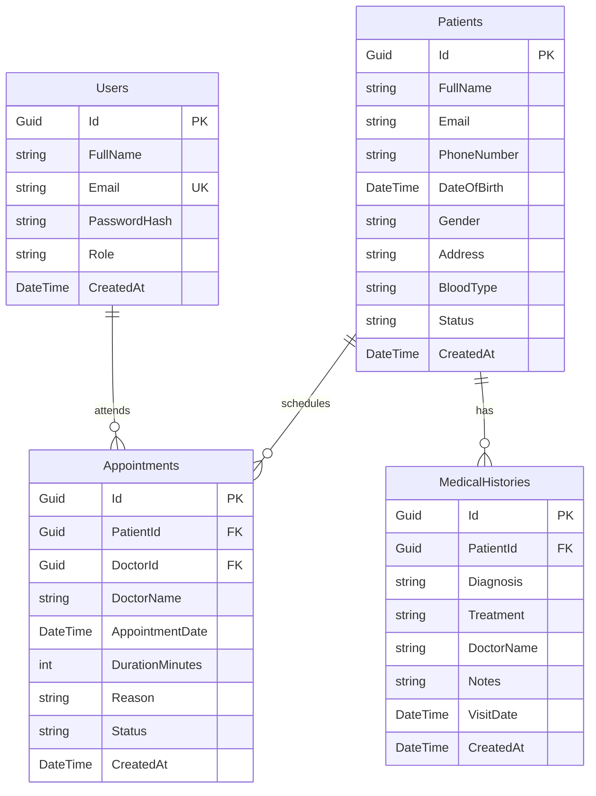

# Database Design Schema (ERD)

This document contains the schema details and relationships for the Healthcare CRM database.

## Entity Relationship Diagram (ERD)

---

## Database Table Schemas

### 1. Users Table
Stores physician login credentials and account information.

| Column Name | Data Type | Nullable | Constraints | Description |
|:---|:---|:---:|:---|:---|
| `Id` | `UniqueIdentifier` | No | Primary Key | Unique identifier for each user |
| `FullName` | `NVarChar(100)` | No | - | Full name of the user/physician |
| `Email` | `NVarChar(150)` | No | Unique Key | Unique login email address |
| `PasswordHash` | `NVarChar(Max)` | No | - | Securely hashed user password |
| `Role` | `NVarChar(50)` | No | Default: 'Doctor' | Admin, Doctor, or Receptionist |
| `CreatedAt` | `DateTime` | No | Default: Now | Timestamp of profile registration |

### 2. Patients Table
Stores patient clinical charts and basic contacts.

| Column Name | Data Type | Nullable | Constraints | Description |
|:---|:---|:---:|:---|:---|
| `Id` | `UniqueIdentifier` | No | Primary Key | Unique identifier for each patient |
| `FullName` | `NVarChar(100)` | No | - | Full name of the patient |
| `Email` | `NVarChar(150)` | Yes | - | Optional email address |
| `PhoneNumber` | `NVarChar(20)` | No | - | Active phone contact |
| `DateOfBirth` | `DateTime` | No | - | Birth date (used to compute age) |
| `Gender` | `NVarChar(20)` | No | - | Male, Female, or Other |
| `Address` | `NVarChar(250)` | Yes | - | Primary residence address |
| `BloodType` | `NVarChar(10)` | Yes | - | Patient blood type (e.g. O+, A-, etc.) |
| `Status` | `NVarChar(50)` | No | Default: 'Active' | Active, Inactive, Suspended |
| `CreatedAt` | `DateTime` | No | Default: Now | Date chart was registered |

### 3. Appointments Table
Tracks medical appointments scheduled by patients.

| Column Name | Data Type | Nullable | Constraints | Description |
|:---|:---|:---:|:---|:---|
| `Id` | `UniqueIdentifier` | No | Primary Key | Unique identifier for each appointment |
| `PatientId` | `UniqueIdentifier` | No | Foreign Key | References `Patients.Id` (Cascade delete) |
| `DoctorId` | `UniqueIdentifier` | Yes | Foreign Key | References `Users.Id` (Nullable for backward compatibility) |
| `DoctorName` | `NVarChar(100)` | No | - | Name of the assigned physician |
| `AppointmentDate` | `DateTime` | No | - | Day and time of the appointment |
| `DurationMinutes`| `Int` | No | Default: 30 | Duration of the slot in minutes |
| `Reason` | `NVarChar(500)` | Yes | - | Chief complaints / reason for visit |
| `Status` | `NVarChar(50)` | No | Default: 'Scheduled' | Scheduled, Completed, or Cancelled |
| `CreatedAt` | `DateTime` | No | Default: Now | Timestamp of booking |

### 4. MedicalHistories Table
Stores patient clinical visit diagnoses and notes.

| Column Name | Data Type | Nullable | Constraints | Description |
|:---|:---|:---:|:---|:---|
| `Id` | `UniqueIdentifier` | No | Primary Key | Unique identifier for each record |
| `PatientId` | `UniqueIdentifier` | No | Foreign Key | References `Patients.Id` (Cascade delete) |
| `Diagnosis` | `NVarChar(200)` | No | - | Clinical diagnosis text |
| `Treatment` | `NVarChar(200)` | Yes | - | Prescribed treatment or prescriptions |
| `DoctorName` | `NVarChar(200)` | Yes | - | Physician who performed the diagnosis |
| `Notes` | `NVarChar(1000)` | Yes | - | Extra clinical observation comments |
| `VisitDate` | `DateTime` | No | - | Date of the clinical consultation |
| `CreatedAt` | `DateTime` | No | Default: Now | Record creation timestamp |
