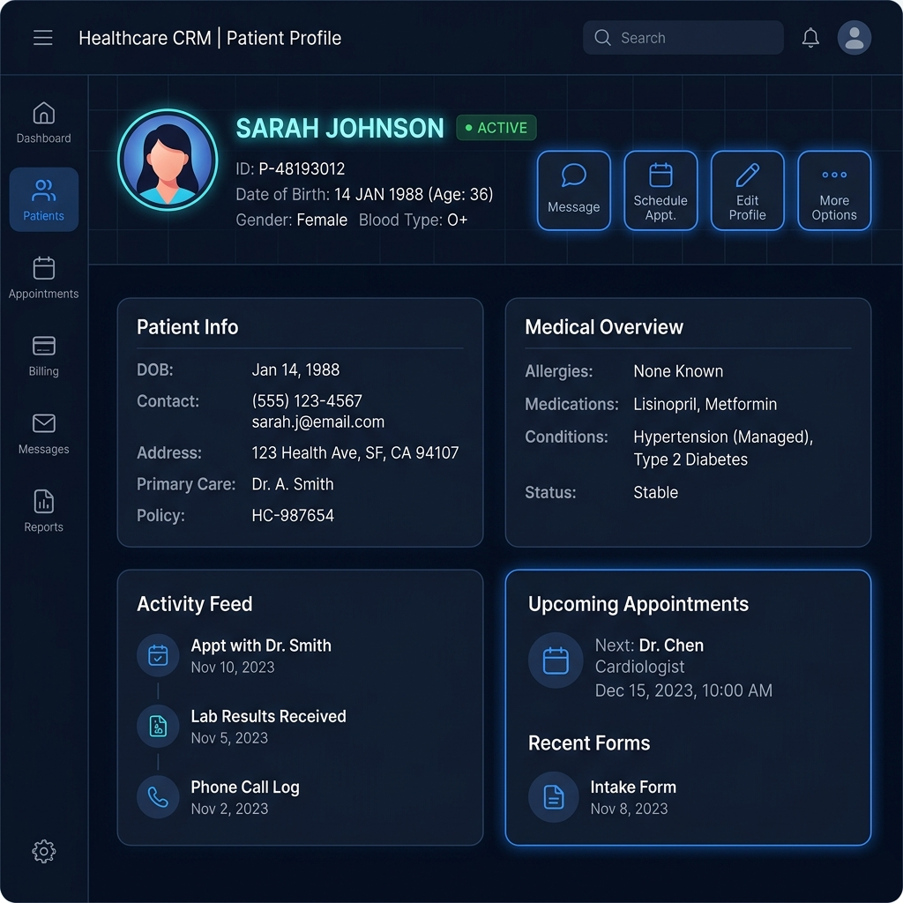
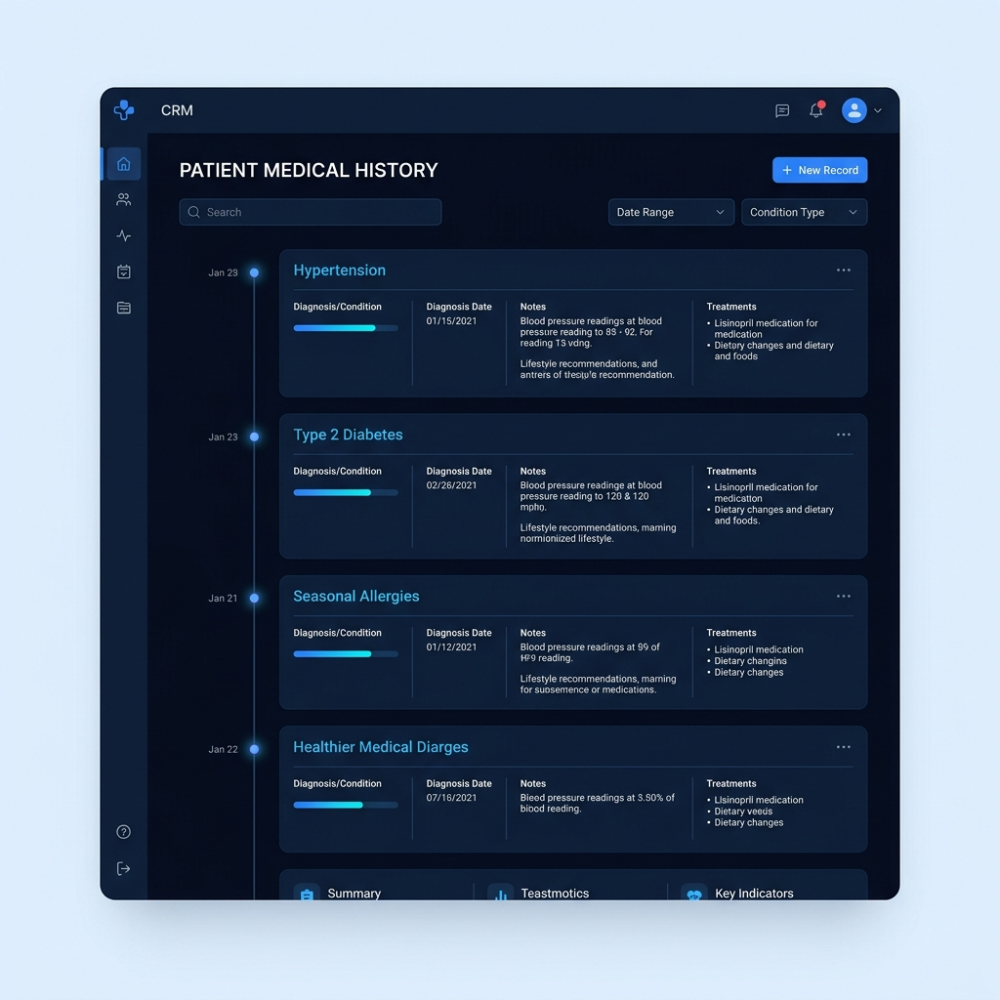

# Walkthrough - Weeks 1-4 Deliverables

We have successfully completed all deliverables for **Track A (Healthcare CRM)** up through **Week 4 (Appointment Booking & Conflict Management Module)**, covering all requirements for Member A, B, and C tasks.

The application styling is fully integrated with **Tailwind CSS v3** with glassmorphic layouts, consistent form grids, and smooth animations.

---

## 1. Accomplishments

### Week 4: Appointment Booking & Conflict Management Module
* **Appointment Entity Model**: Created `Appointment.cs` with foreign keys to `Patients` and `Users` (Doctors), with fields for `DoctorName`, `AppointmentDate`, `DurationMinutes`, `Reason`, `Status`, and `CreatedAt`.
* **Appointment CRUD & Availability APIs**:
  * Implemented REST endpoints in [AppointmentsController.cs](file:///E:/Friendsware%20summmer%20internship/Task2/src/HealthcareCRM/Controllers/Api/AppointmentsController.cs): `GET`, `POST`, `PUT`, `DELETE` by ID, and `GET` list filtered by doctor and date.
  * Implemented `GET /api/appointments/availability` to list a doctor's booked slots for a given day.
* **Double-Booking Prevention**:
  * **Doctor Buffer**: Enforced a mandatory 45-minute buffer between doctor appointments. Blocked slots return `409 Conflict`.
  * **Patient Overlap**: Prevented patients from scheduling overlapping consultations across all clinics/physicians.
* **Appointments UI Page & Form**:
  * Enhanced [List.cshtml](file:///E:/Friendsware%20summmer%20internship/Task2/src/HealthcareCRM/Views/Appointment/List.cshtml) layout with a filter bar (Doctor selection, Date picker, Status selection) and a live appointments table.
  * Integrated a glassmorphic modal form with patient/doctor selectors, datetime pickers, and duration settings.
  * Added a **Live Availability Panel** displaying a doctor's booked slots and inline validation warning messages for conflicting slots.
  * Implemented cancellation action buttons that trigger the HTTP DELETE endpoint and refresh the list automatically.
* **Automated & Security Tests**:
  * Created [AppointmentTests.cs](file:///E:/Friendsware%20summmer%20internship/Task2/src/HealthcareCRM.Tests/AppointmentTests.cs) with 8 tests covering validation rules, filtering, CRUD operations, and controller authorization checks.
  * Ensured `[Authorize]` JWT rules are verified at compile-time and runtime.

### Week 3: Core Data Module
* **Patient Model Expansion**: Expanded `Patient.cs` with `BloodType` (optional, max-length 10) and `Status` (required, defaults to `"Active"`).
* **Medical History Model**: Created the `MedicalHistory.cs` entity model linked to Patients.
* **Database Upgrades**: 
  * Updated [create_patients_table.sql](file:///E:/Friendsware%20summmer%20internship/Task2/src/HealthcareCRM/Data/create_patients_table.sql) to add `BloodType` and `Status` to `Patients`, and create the `MedicalHistory` table with proper indices.
  * Updated database context [ApplicationDbContext.cs](file:///E:/Friendsware%20summmer%20internship/Task2/src/HealthcareCRM/Data/ApplicationDbContext.cs) with the `MedicalHistories` DbSet, updated seed patients, and sample seeded `MedicalHistory` records.
  * Updated the Mermaid diagram and table definitions in [erd.md](file:///E:/Friendsware%20summmer%20internship/Task2/src/HealthcareCRM/docs/erd.md).
* **Patients API Hardening**:
  * Implemented the `DELETE /api/patients/{id}` endpoint in [PatientsController.cs](file:///E:/Friendsware%20summmer%20internship/Task2/src/HealthcareCRM/Controllers/Api/PatientsController.cs).
  * Updated `GET /api/patients` search logic to filter by `FullName` and `PhoneNumber`.
  * Updated `POST` and `PUT` endpoints to bind the new `BloodType` and `Status` fields.
* **Patient List Page (`List.cshtml`)**:
  * Added a **Status** column (rendered with dynamic Tailwind badges).
  * Added a **Delete** action button wired to the DELETE patient API.
  * Integrated a live **loading spinner** during AJAX data fetches.
  * Handled **empty states** with a friendly message when no patients match the search criteria.
* **Patient Add/Edit Pages**:
  * Added a **Blood Type** dropdown selection list to [Add.cshtml](file:///E:/Friendsware%20summmer%20internship/Task2/src/HealthcarePatient/Add.cshtml) registration form.
  * Added **Blood Type**, **Status** dropdowns, and a **Delete Profile** button to [Edit.cshtml](file:///E:/Friendsware%20summmer%20internship/Task2/src/HealthcarePatient/Edit.cshtml) form.
* **Automated Tests**: Added 2 new tests in [PatientTests.cs](file:///E:/Friendsware%20summmer%20internship/Task2/src/HealthcareCRM.Tests/PatientTests.cs) (totaling 18 solution tests) covering patient deletion and searching by contact number.

### Week 2: Auth Hardening & Role-Based Access Control (RBAC)
* **Model & RBAC**: Added `Role` property to `User.cs` model, supporting `Admin`, `Doctor`, and `Receptionist` roles.
* **JWT Claims & Routing**: Mapped user roles to JWT claims payload (`ClaimTypes.Role`) and implemented client-side role-based routing redirects on login.
* **Access Control Filter**: Upgraded custom auth filter `[JwtAuthorize]` in [JwtAuthorizeAttribute.cs](file:///E:/Friendsware%20summmer%20internship/Task2/src/HealthcareCRM/Helpers/JwtAuthorizeAttribute.cs) to check user roles and redirect unauthorized access to `/Account/AccessDenied`.
* **Role Management View**: Created [RoleManagement.cshtml](file:///E:/Friendsware%20summmer%20internship/Task2/src/HealthcareCRM/Views/Account/RoleManagement.cshtml) for Admins to view the physician directory and update their roles dynamically.

### Week 1: Core Foundation & CRUD
* **Member A (Auth & Onboarding)**: Custom login and registration pages, `/api/auth/register` and `/api/auth/login` APIs, secure hashing using `PasswordHasher`.
* **Member B (Patient Module)**: `Patient` domain model, REST endpoints, and MVC views.
* **Member C (Setup, QA & Integration)**: Solution architecture structure, environment variable loader, API status checks at `/api/health`, Swagger UI integration at `/swagger`, and ERD schemas.

---

## 2. UI/UX Wireframes

Below are the generated screens for the deliverables:

### Patient Profile Screen Wireframe


### Medical History Screen Wireframe


---

## 3. Test Verification

The entire solution compiles and executes clean of warnings or errors, passing all **18 unit tests**:

```powershell
dotnet test src/HealthcareCRM.sln
```

**Results Output:**
```
Passed!  - Failed:     0, Passed:    18, Skipped:     0, Total:    18, Duration: 2.1 s - HealthcareCRM.Tests.dll (net8.0)
```
